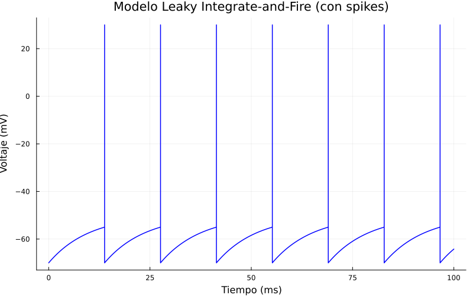

# Computational Modelling of Neuronal Dynamics: The Leaky Integrate-and-Fire Framework

## Abstract

The Leaky Integrate-and-Fire (LIF) model represents a fundamental abstraction in computational neuroscience, designed to simulate neuronal behaviour with computational efficiency.

This manuscript elucidates the theoretical foundation of the LIF model, drawing upon electrical circuit analogies to characterise membrane potential dynamics. Additionally, we detail the numerical implementation of the model using the Julia programming language, employing Euler discretisation to solve the governing differential equations.

The framework captures essential neuronal properties, including subthreshold integration, membrane leakage, action potential generation, and reset mechanisms.

## 1. Introduction

In biological systems, neurones function as excitable cells that process information through electrochemical signalling. The canonical sequence of neuronal activity involves the reception of synaptic inputs, the integration of these signals within the soma, and the generation of an action potential (spike) upon reaching a critical voltage threshold. Following this event, the membrane potential resets, allowing the cycle to commence anew.

While detailed biophysical models (e.g., Hodgkin–Huxley) offer high fidelity, they often incur significant computational costs. The Leaky Integrate-and-Fire (LIF) model provides a simplified yet robust alternative. It aims to replicate the core dynamics of neuronal firing using reduced mathematical complexity.

Conceptually, the LIF model may be understood through a hydraulic analogy: consider a vessel with a leakage point. As fluid (current) is added, the water level (voltage) rises; however, simultaneous leakage causes a gradual decay. If the water level reaches the brim (threshold), the vessel empties abruptly (fires) and refills to a baseline level.

This analogy underscores the three defining characteristics of the model: leakage, integration, and firing.

## 2. Mathematical Formulation

### 2.1 Electrical Circuit Analogy

The neurone is modelled as an equivalent electrical circuit comprising two primary passive components:

- **Capacitor ($C$):** Represents the lipid bilayer membrane's capacity to store charge (voltage).  
- **Resistor ($R$):** Represents the ion channels that allow current to leak across the membrane.

This RC circuit configuration yields a first-order linear differential equation describing the temporal evolution of the membrane potential $V$.

### 2.2 Governing Equation

The dynamics of the membrane potential are governed by the following equation:

$$
\tau \frac{dV}{dt} = -(V - V_{\text{rest}}) + R I
$$

Where:

- $V$ denotes the instantaneous membrane potential.  
- $V_{\text{rest}}$ represents the resting potential (baseline voltage).  
- $I$ is the input current injected into the neurone.  
- $R$ is the membrane resistance.  
- $\tau = RC$ is the membrane time constant, determining the rate of leakage.

The equation indicates that the rate of change in voltage $\frac{dV}{dt}$ depends on the deviation from the resting potential (leakage term) and the magnitude of the input current (integration term).

### 2.3 Firing and Reset Mechanism

The model incorporates a discontinuous event to simulate the action potential. A spike is generated when the membrane potential exceeds a predefined threshold $V_{\text{threshold}}$:

$$
\text{If } V \geq V_{\text{threshold}} \rightarrow \text{Emit spike}
$$

Immediately following a spike, the membrane potential is reset to a specific value $V_{\text{reset}}$, typically equal to $V_{\text{rest}}$, to simulate the refractory period and prepare the neurone for subsequent integration.


## 3. Computational Implementation

### 3.1 Numerical Discretisation

To simulate the continuous differential equation on a digital computer, the equation must be discretised. We employ the forward Euler method for numerical integration. The continuous derivative is approximated over a discrete time step $dt$:

$$
dV = \frac{-(V - V_{\text{rest}}) + R I}{\tau}
$$

The membrane potential is then updated according to:

$$
V_{t+dt} = V_t + dV \cdot dt
$$

This discretisation enables stepwise numerical simulation of the membrane dynamics.

### 3.2 Software Environment and Parameters

The simulation was implemented using the Julia programming language, chosen for its high performance in numerical computing. The `Plots` package was utilised for data visualisation, with additional customisations for enhanced clarity, including line width adjustment and grid display.

The specific parameters employed in this implementation are detailed in Table 1. Notably, the input current was increased to induce repetitive spiking, and a spike visualisation parameter was introduced to represent action potentials graphically.

#### Table 1. Simulation Parameters

| Parameter                       | Symbol                   | Value  | Unit  |
|---------------------------------|--------------------------|--------|-------|
| Resting Potential               | $V_{\text{rest}}$        | -70.0  | mV    |
| Reset Potential                 | $V_{\text{reset}}$       | -70.0  | mV    |
| Threshold Potential             | $V_{\text{threshold}}$   | -55.0  | mV    |
| Spike Visualisation Potential   | $V_{\text{spike}}$       | 30.0   | mV    |
| Membrane Resistance             | $R$                      | 10.0   | M$\Omega$ |
| Time Constant                   | $\tau$                   | 10.0   | ms    |
| Input Current                   | $I$                      | 2.0    | nA    |
| Time Step                       | $dt$                     | 0.1    | ms    |
| Total Duration                  | $T$                      | 100.0  | ms    |

*Note: Membrane resistance is expressed in M$\Omega$ (megaohms), which is standard in neuronal modelling.*

---

### 3.3 Algorithmic Structure

The simulation proceeds iteratively through the following steps:

1. **Initialisation:** Set $V = V_{\text{rest}}$ at $t = 0$, and initialise arrays for recording time and voltage.  
2. **Integration:** Calculate the change in voltage ($dV$) based on the governing equation and update $V$ using the Euler method.  
3. **Recording:** Store the updated voltage and time point.  
4. **Threshold Check:** Evaluate whether $V \geq V_{\text{threshold}}$.  
5. **Spike and Reset:** If the threshold is exceeded, insert a visual spike at $V_{\text{spike}}$ for plotting purposes, record the event, and immediately reset $V = V_{\text{reset}}$.  
6. **Termination:** Repeat until the total simulation time $T$ is reached.

This structure enables the visualisation of a spike train, demonstrating integrate-and-fire dynamics under suprathreshold input. The core implementation logic is presented in Listing 1.

---

### Listing 1. Core Simulation Code in Julia

```julia
using Plots

# Parameters
V_rest      = -70.0
V_reset     = -70.0
V_threshold = -55.0
V_spike     =  30.0      # Typical AP peaks reach +30–+40 mV
R           =  10.0
tau         =  10.0
I           =   2.0      # Increased to induce repetitive spiking

dt = 0.1
T  = 100.0
steps = Int(T / dt)

V = V_rest
t = 0.0
tiempos  = Float64[t]
voltajes = Float64[V]

for i in 1:steps
    dV = (-(V - V_rest) + R * I) / tau
    V += dV * dt
    t += dt

    push!(voltajes, V)
    push!(tiempos, t)

    if V >= V_threshold
        # Visual spike (one time step duration)
        push!(voltajes, V_spike)
        push!(tiempos, t)

        # Immediate reset
        V = V_reset
        push!(voltajes, V)
        push!(tiempos, t)
    end
end

plot(tiempos, voltajes,
    xlabel = "Time (ms)",
    ylabel = "Voltage (mV)",
    title  = "Leaky Integrate-and-Fire Model (with spikes)",
    legend = false,
    linewidth = 1.5,
    grid = true,
    size = (800, 500)
)
```



## 4. Discussion of Dynamics

The simulation characterises the typical behaviour of a **LIF neurone** under constant current injection.

### Initial State
Initially, the voltage resides at the resting potential (**-70 mV**). Upon application of current (**I = 2.0**), the voltage begins to ascend exponentially towards the equilibrium potential (approximately **-50 mV**), passing intermediate values such as -69, -68, and so forth. 

> This phase represents the **integration of input signals**, where the membrane behaves analogously to a charging capacitor.

### Leakage Effect
Concurrently, the leak term `-(V - V_rest)` opposes this rise, pulling the voltage back towards the resting state and producing an **exponential trajectory** rather than a linear ramp.

### Firing Mechanism
Since the input current is sufficient to overcome leakage (with the equilibrium potential above threshold), the voltage reaches and exceeds the threshold (**-55 mV**). At this juncture, the model registers a **firing event**, visualised as a brief spike to **+30 mV**, representing the overshoot of a biological action potential.

The membrane potential is immediately reset to **-70 mV**, simulating the repolarisation phase. This cycle repeats, generating a **regular spike train** whose frequency depends on the magnitude of the input current **I**.

### Analytical Firing Rate

Under steady-state conditions, the firing rate can be approximated analytically as:

$$
f = \frac{1}{\tau \ln \left( \frac{R I - (V_{\text{threshold}} - V_{\text{rest}})} {R I - (V_{\text{reset}} - V_{\text{rest}})} \right)}
$$

For **I = 2.0**, the inter-spike interval is approximately **20–25 ms**, corresponding to a firing rate of roughly **40–50 Hz**.

## 5. Conclusion

The **Leaky Integrate-and-Fire model** provides a computationally efficient framework for simulating neuronal activity. 

### Key Features

- Abstracts the neurone into a **leaky capacitor circuit**
- Captures essential phenomena:
  - Integration of inputs
  - Leakage currents
  - Threshold-based firing
  - Repetitive spiking under suprathreshold inputs

### Implementation Highlights

The implementation in **Julia**, enhanced with explicit spike visualisation, demonstrates that complex neuronal dynamics can be reproduced using **concise numerical methods**.
